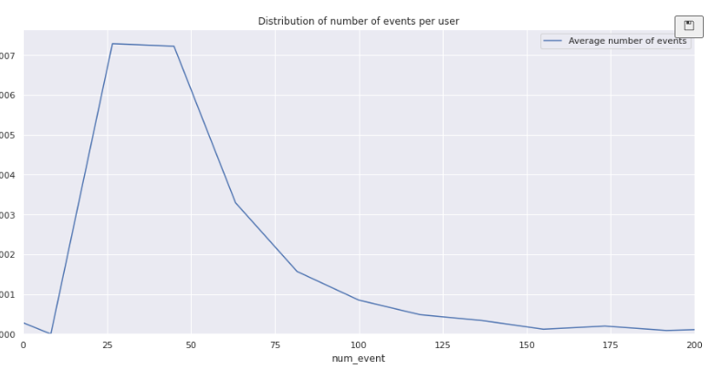

## **Table of Contents**
### [1. Project and task description](#1)
### [2. Data Preprocessing](#2)
### [3. Study and check the data](#3)
### [4. Study the event funnel](#4)
### [5. Study the results of the experiment](#5) 

  
### **Project Description**  
A Startup  sells food products. Investigate user behavior for the company's app.

Each log entry is a user action or an event  
`EventName` — event name  
`DeviceIDHash` — unique user identifier  
`EventTimestamp` — event time  
`ExpId` — experiment number: 246 and 247 are the control groups, 248 is the test group  

Then look at the results of an A/A/B test. The designers would like to change the fonts for the entire app, but the managers are afraid the users might find the new design intimidating. They decide to make a decision based on the results of an A/A/B test.  

The users are split into three groups: two control groups get the old fonts and one test group gets the new ones. Find out which set of fonts produces better results.  

Creating two A groups has certain advantages. We can make it a principle that we will only be confident in the accuracy of our testing when the two control groups are similar. If there are significant differences between the A groups, this can help us uncover factors that may be distorting the results. Comparing control groups also tells us how much time and data we'll need when running further tests.  

  
### **Task**
 - First study the sales funnel.  
 - Find out how users reach the purchase stage.
 - How many users actually make it to this stage?
 - How many get stuck at previous stages? Which stages in particular?

  
### **Data Preprocessing**  
We have prepocessed the data and the following changes have been made:
 1. Columns were renamed for the sake of readability.
 2. No missing values were found.
 3. 413 duplicated values were detected and removed.
 4. `event_datetime` column converted to datetime type; dates were extracted on separate column `event_date` and time exracted and saved to `event_time` columns.

  
### **Study and check the data**  
1.  average number of events per user  

2. 