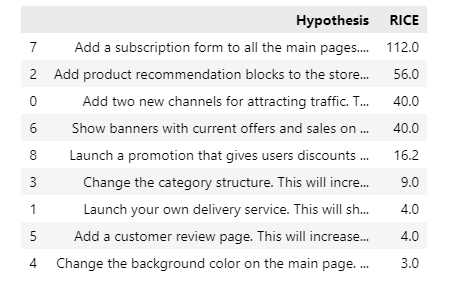

## **Table of Contents**
### [1. Project and goal description](#1)
### [2. Data Analysis](#2)
### [3. Testing Statistical Hypotheses](#3)
### [4. Overall Conclusion](#4)

 

### **Project description**
Together with the marketing department, we've compiled a list of hypotheses that may help boost revenue.  
We need to prioritize these hypotheses, launch an A/B test, and analyze the results.

### **Goal of the Project**
Prioritize hypotheses, launch an A/B test, and analyze the results.  

### **Data Analysis**  
1. Prioritize hypotheses through ICE (Impact*Confidence/Effort)
 
 
2. RICE (Reach*Imapact*Confidenc/Effort)  

3. Graph cumulative revenue by testing group  

The graph below illustrates the revenue of two groups for a period of a month. From August 2019 to September 2019. Revenue is rising steadily throughout the whole test in both groups. That's a good sign. But we can see a hughe spike from 30k to 50 in revenue after the second week of testing. Thats clearly a sign that has worked sucessfully resulting in higher revenue for group B.

4 Graph cumulative average order size by group

Average purchase size also increases after the first week of the test. It stabilizes for group A and skyrockets for group B on the same period where we have seen the huge increase in revenue. The surge in group B in the second half of the test may have been due to the presence of large, expensive orders or product seasonality.

### **Following hypotheses were tested:**  
1. Find the statistical significance of the difference in conversion between the groups using the raw data.
2. Find the statistical significance of the difference in average order size between the groups using the raw data.
3. Find the statistical significance of the difference in conversion between the groups using the filtered data.
4. Find the statistical significance of the difference in average order size between the groups using the filtered data.

*Note:* To calculate the statistical significance of the difference in the segments' average order size, we'll pass the data on revenue to the `mannwhitneyu()` method.  

### **Overall Conclusion:**

After having calculated all the necessary metrics for the conducted A/B test, we came up to the following conclusions:
 There's a statistically significant difference in conversion between the groups, according to both the raw and the filtered data. Group B has higher conversion rate than group A.  
 The raw data didn't show a statistically significant difference between the groups in terms of average purchase size in both raw and the filtered data.However, after the anomalies were removed, the relative difference became smaller.  
 The graph of the difference in conversion between the groups shows that group B's results are better than those of group A: conversion rates of both groups seem to be stabilized after the first week of testing period. Overall, the conversion rate of group B is slightly higher than the conversion rate of group A.  

 At several points the difference between the segments spikes. This means there must be some big orders and outliers! We'll find them later. The average order size of group B is comparatively bigger than the average order size of group A in the second half of the test period.

 We have found out that there were 72 abnormal users(outliers) in our dataframe but their effect was not significant
 At this point, we can conclude that we came to the end of our analysis of the hypothesis and call it success and move to the next hypothesis.

<a href="./AB_testing.ipynb">Jupyter notebook</a> 