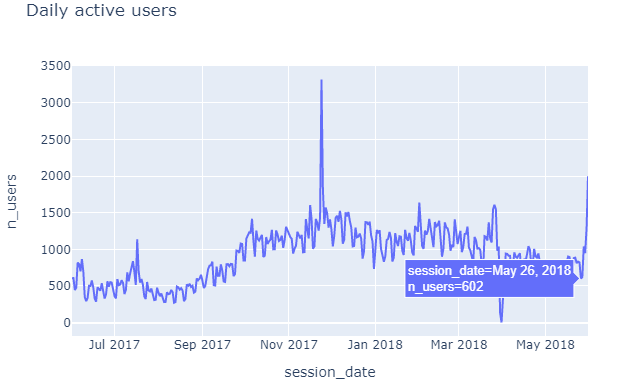
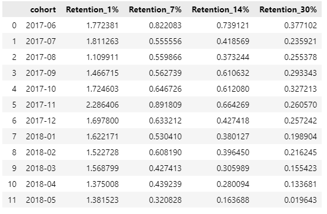
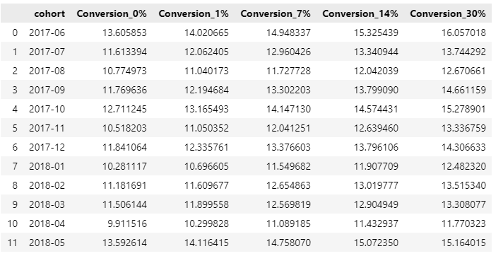
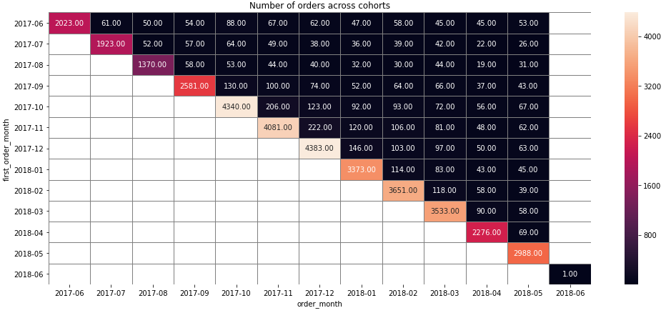
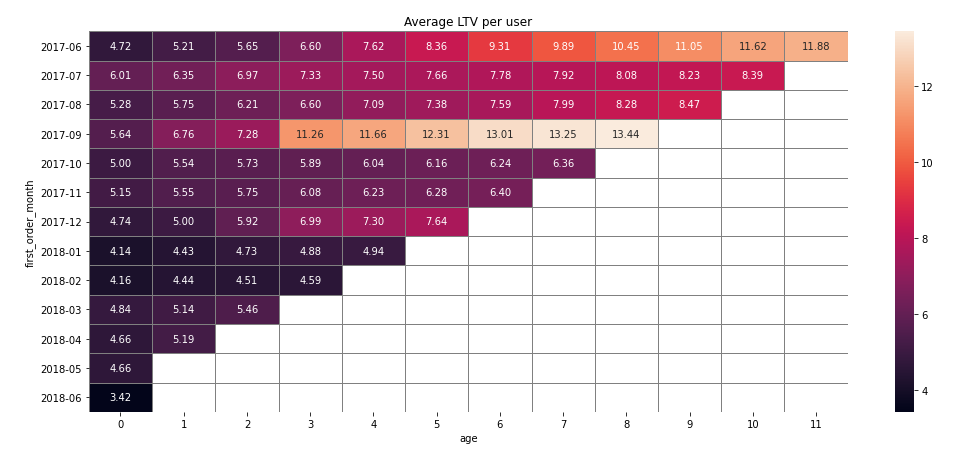
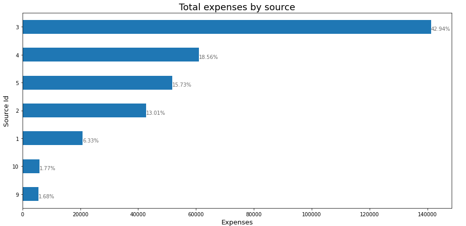
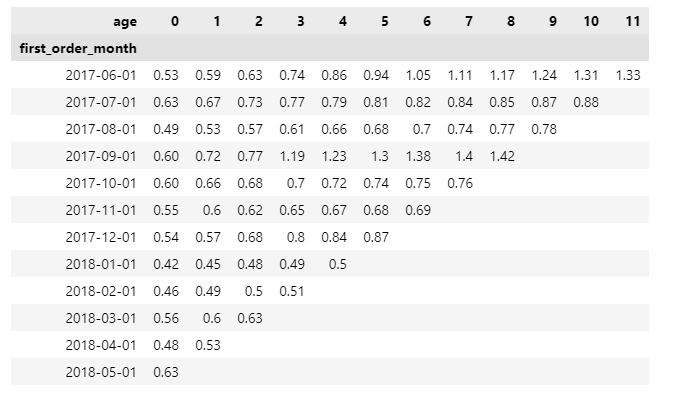

## Project description
The task is to help optimize marketing expenses of the application which is available for both `desktop` and `mobile` user that provides online upcoming events. We were provided datasets to work with and come up with suggestions. 

 ## The analysis overview:
 - Average daily/weekly/monthly active users | plotly visualization:
 - Average session per day (# sessions / # of users for period)
 - Duration of the session (end_time - start_time)
 - Cohort analysis
 - Retention & Conversion calculation

## Overall Conclusion

The ultimate goal of this analysis was to optimize marketing expenses by calculating business metrics of Yandex.Afisha.
We were provided a datasets: 

<b>`Visits` --> Server logs with data on Yandex.Afisha visits from June 2017 through May 2018</b> 
    
`uid`: user's unique identifier  
`device`: user's type of device 
`start_ts`: session start date and time 
`end_ts`:  session end date and time 
`source_id`: identifier of ad source the user came from  
    
<b>`Orders` --> Dump file with all orders for the period</b> 
`uid`: unique identifier of the user making an order 
`buy_ts`:  order date and time 
`revenue`: Yandex.Afisha's revenue from the order   

<b>`Costs` --> Marketing expenses statistics</b> 
`source_id`: ad source identifier 
`dt`: date 
`costs`: expenses on this ad source on this day.  

Before jumping right into analysis, we had to do data preprocessing, getting the dataset cleaned and accurate. We have looked through each columns of the dataset and made decisions on preprocessing. The following changes have been made: 
 - All columns of our dataframes were replaced with lowercase letters
 - All columns of our datasets were changed to certain types (e.g. `device` column to category type) for the sake of optimization
 - All columns containing dates were changed to datetime formats(e.g. `start_ts` and `end_ts` columns to datetime)
 - Dataframes were checked for duplicates and missing values.

Next step which was *calculating business metrics on product* we have looked through the followings : 
 - Total daily/weekly/monthly active users = 908, 5,724 and 23,228 respectively; plotted a graph to see the user activity.
  

 - Users on average have 1 session per day.
 - Average length of sessions were not distributed normally, therefore we took the mode = 60 seconds each session's duration.
 - Retention rates were following the logical pattern where users' possibility to come back to app gets higher as the time passes which implies higher retention rates in earlier days comparing to later. We have looked retention rates both by cohorts and source id to see when and from which source users mostly come back. Results show that most users come from sources 1 and 2. November 2017 cohort has the highest retention rate = 2.28%  on user's 1st day meaning the next day after their registration. 

  

In our further step which was *calculating business metrics on sales* we have looked through the followings : 
 - Conversion rate that tells us when do people start buying. Conversion rates also differ across cohorts and source ids. We have calculated conversion rate by source id and cohorts to see when users buy stuff and from which source. Important nuance to mention that conversion rates are cumulative metric which means we will calculate for period inclusive all dates. For example if we look at conversion rate within a month (30 days) we take into account all users who made a purchase within this period.And the results showed us that users coming from source 1 make more purchases than any other source. June 2017, had the highest conversion rate of 16 %.

 

 - Number of orders across cohorts also are different. That could be explained by the seasonality of the product.November 2017 shows us that user made more orders than any other month throughout reporting peroid. There is also robust reason which is the Black Friday which takes place on the Last Friday of November each year.

 

 - Following orders we have calculated the average purchase size that coincides with November month showing the significant incrase in average revenue per user where they made most orders.
 - Average Life-time value of users tells us how much a user brought to the company throughout their active purchase on Yandex.Afisha. Lifetime revenue per user differs across cohorts mostly because of seasonality as we have mentioned before. Let us take examples of two cohorts with the highest revenue per user's lifetime. July 2017 which is our first cohort, on average each customer brough  11.88 USD  in revenue over their eleventh-month lifetime, whereas September 2017 cohort users brought 13.44 USD within thier eighth lifetime. It would be relatively logical the ratio of ltv and cost of customer acquisiton to see where the company stands in terms of return on marketing investment.

 

The next step was *calculating metrics on marketing* mainly return on marketing investment and cost of acquisition. 
 - We have analysed how much money was spent overall/per source/over time. Source 3 had the highest expenses where 42.9 % of our investment goes to only source 3 followed by source 4 with 18.6% of total expenses. The company had higher revenue in 2017 and consequently more investments followed in the same year. It is worth to mention that for 2018 we have data till May, so it is not comparable with 2017.

 

 - Customer acquistion from each source are different. It is also important to mention that we have to take into account only those visitors who converted to buyers not all visitors. Source number 3 has the highest cost of advertisement and higher CAC = 10. 2 USD comparing to other sources which their CAC lie between 2-5 USD. The CAC of source 3 almost doubles the cost of acquisition of other sources. We can see that company invests and focuses on source 3 a lot. 

Finally, Return on Marketing investment was calculated. For a company to be on a profit side, it must have its LTV greater than CAC. The results show the same pattern.  For the first cohort, acquiring each customer cost the company an average of 8.90, while each customer brought in 11.87. So investment in customer acquisition is paying off. We have  run calculations for the other cohorts and determined the number of months each cohort requires to cover marketing expenses. Well, return on marketing expenses differ across cohorts as well. For instance, September 2017 cohort paid off after 3 months while cohorts after Septermber have not yet. This implies that the average time to recoup marketing investments are longer than 3 months. Let us find out how quickly cohorts pay off on average. On average, cohorts pay off toward the end of the 8th month.

 

We would like to conclude that for planning advertising campaigns, we have to be careful about the sourcses in which we invest our money and it is better to diversify investment portfolios rather than placing everyting in one place. It is a must to consider that for marketing investments to pay off one customer acquisition can not cost more than $9.0835. Since our customers bring that amount of money in the 8 month period which is also the time to pay off.

<a href="./marketing_expenses_optimization.ipynb">Jupyter Notebook</a>   
 
