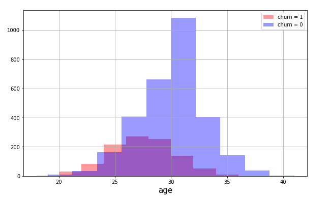
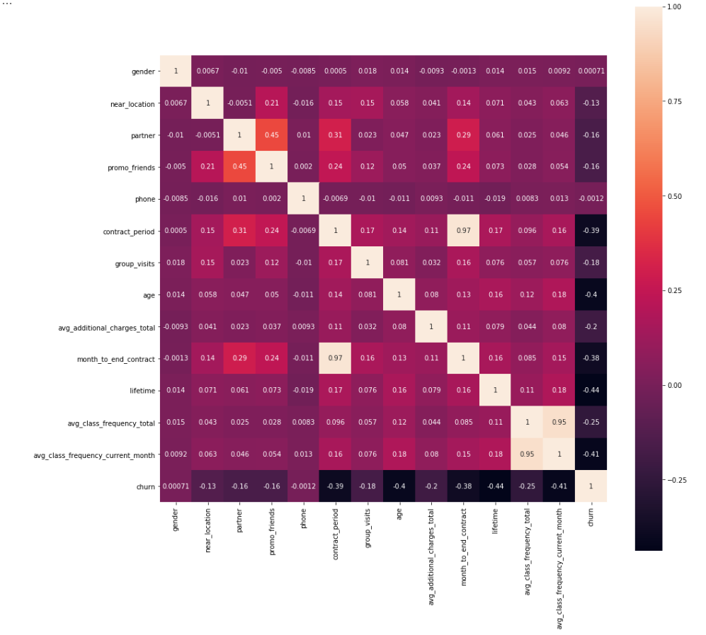
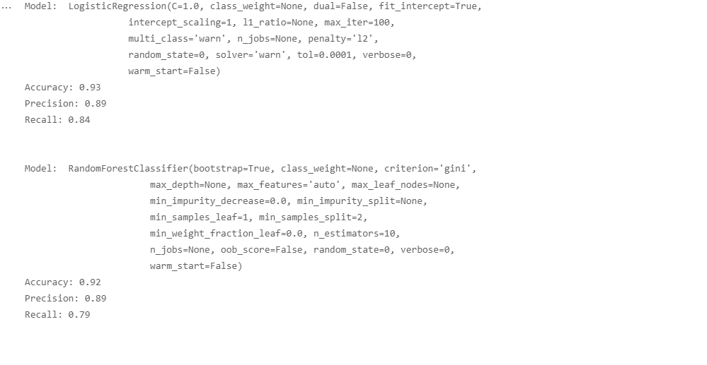
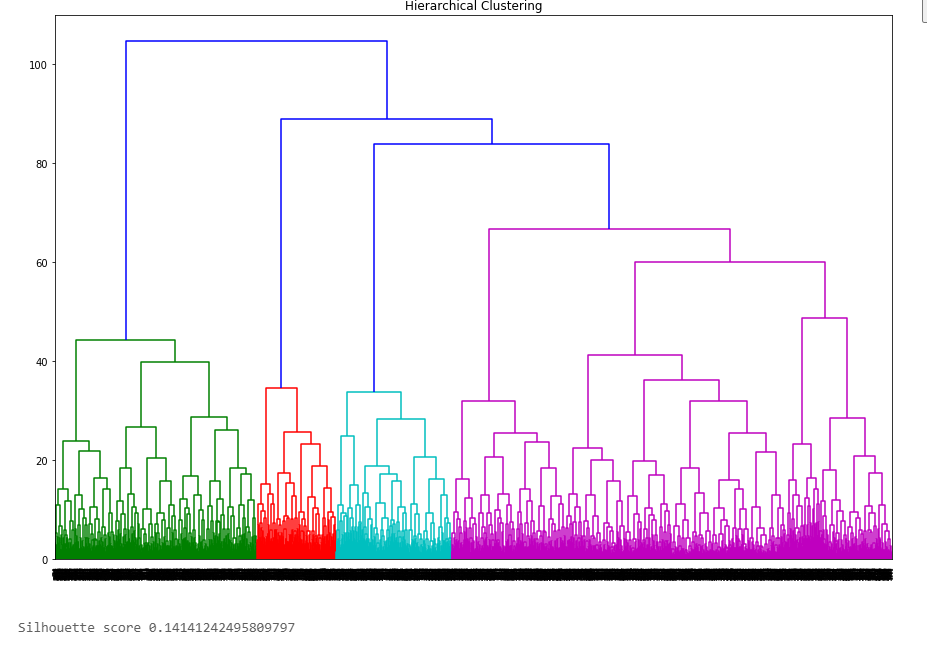
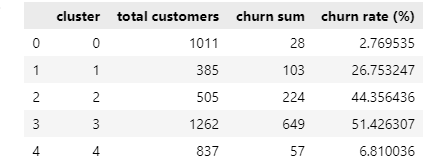

## **Table of Contents**
### [1. Project and goal description](#1)
### [2. Exploratory Data Analysis](#2)
### [3. Model for customer churn prediction](#3)
### [4. Creating user cluster](#4)
### [5. Overall Conclusion and recommendation](#5)

 

### **Project description**
The gym chain Model Fitness is developing a customer interaction strategy based on analytical data. 

### **Goal of the Project**
Analyze customer profiles and come up with a customer retention strategy.

### **Exploratory Data Analysiss**  

*1. Plotting distribution of customer churn*
  

 
*2. Correlation matrix*
  

The correlation matrix tells us the following:
 - `contract_period` and `month_to_end_contract` have the strongest positive correlation among other features 0.97 which is quiet logical as they move in the same direction the longer the contract period the longer the month till the end of the contract.
 - `avg_class_frequency_total` and `avg_class_frequency_current_month` have also strong positive correlation = 0.95 which is again logical since total includes the current month, the higher they spend in current month, the higher it will be in total.
 - `lifetime` and `churn` have the strongest negative correlation = -0.44. The longer is customer's lifetime the less likely for them to churn.

### **Model for customer churn prediction**  

We ave set the X variable for features and y variable for target which is `churn` of our dataset. We have divided the dataset to 80/20 where 80% of our dataset will be train set and remaining 20% is a validation set where we will be comparing our predictions with the actual data.
We have built binary classification models which is designed to predict the probability, in our case of churn (for the upcoming month) for each customer.  

  
Accuracy is the share of accurate predictions among all predictions where closer to 1, the better. For this metric, Logistic Regression has a better score = 0.93

Precision tells us what share of predictions in class 1 are true by looking at the share of correct answers only in the target class, where closer to 1, the better. For this metric, Logistic Regression has a better score = 0.86

Recall aims at minimizing the opposite risks by demonstrating the number of real class 1 objects you were able to discover with your model where the closer to 1, the better. For this metric, Logistic Regression has a better score = 0.83

To sum up,  the Logistic Regression model gave better results and we can implement it to forecast.

  

### **Creating user cluster**  
In order to use K-Means clustering (which groups objects step by step under the assumption that the number of user clusters is already known), we must determine the number of user clusters that can be identified. The distance between the objects and the agglomerative hierarchical clustering itself can be visualized with special plots called dendrograms. We have set the n = 5, clusters. We have also calculated  the silhouette score which shows the extent to which an object from a cluster is similar to its cluster, rather than to another one. The closer to 1, the better the clustering.
In our case the Silhouette score is 0.14 which is not high.

 
 
 *Calculating churn rate for each cluster*  

   
 According to the table above, customers from clusters 3 and 2 are most likely to leave with churn rates of 51.4% and 44.3 % respectively.

### **Overall Conclusion and recommendation:**

1. Data was imported and general information about the data was studied. There are 14 columns and 4000 rows in our dataset with the following description:

 - `gender` - client's gender 
 - `near_location` - whether the user lives or works in the neighborhood where the gym is located
 - `partner` - whether the user is an employee of a partner company 
 - `promo_friends` - whether the user originally signed up through a "bring a friend" offer
 - `phone` - whether the user provided their phone number
 - `contract_period`- 1 month, 3 months, 6 months, or 1 year
 - `group_visits` - whether the user takes part in group sessions
 - `age` - user's age 
 - `avg_additional_charges_total` -  the total amount of money spent on other gym services: cafe, athletic goods, cosmetics
 - `month_to_end_contract` - the months remaining until the contract expires
 - `lifetime` - the time (in months) since the customer first came to the gym
 - `avg_class_frequency_total` - average frequency of visits per week over the customer's lifetime
 - `avg_class_frequency_current_month` - average frequency of visits per week over the preceding month
 - `churn`- the fact of churn for the month in question
 

2. After conducting Exploratory data analysis, building two models for churn's prediction, creating clusters and visualizing them, we have identified the most important features that affect user's churn rate and came up with the following conclusions:
 - `near_location` feature plays vital role whether the customer stays or leaves, of course it is logical. If the gym is close to their home/office, customer most probably visits the gym.
 - `partner` feature is also one of the most important features to improve customer retention. Employees from a partner companies also tend to be more closer and loyal to the gym than third party visitors.
 - `promo_friends` feature also makes customer retention better. Clients come  and train together, even have the same schedule can also attract other customers by inviting their friends. Socializing is one of the key factors nowadays.
 - `group_visits` stats also showed that the higher the participation in group sessions the lower the churn rate. Our clients who take part in group sessions most probably are more effective and accurate towards their goals. 
 - `age` is always one of the most important factors to find the suitable target group. The average range of clients who are loyal to the gym is 27-32.
 - `avg_class_frequency_total` clients with the average frequency of visits of 2 times per week show loyalty to gym. The more often user comes to the gym, the higher is their loyalty.

3. Recommendations for betterment customer retention and lower churn rates are the following:
 - For acquiring new customers, we should focus on customers that live near to gym location, who are employees at a partner company and between the ages of 27 and 32 years. The data shows that customers who fall under one or (ideally) all of these categories are less likely to churn.
 - For already existing customers, encourage them to spend more money on other gym services  and services and increase their amount of weekly visits by providing discounts on products. These are all factors that make a customer less likely to churn.Example could be providing special training courses or showing live events in bars make visitors to stay longer or come more often. Additionally, we focus on customers who have 1-2 months before their current contract ends. This is when customers are more likely to decide whether to continue their subscription or not. 
 - Not to forget about our main target. The most loyal customers are those who are between the ages of 27 and 34, who spend the most on other gym services, who live near the location, who are employees at partner companies, who spend money on additional gym services and who visit the gym about 2 times on a weekly basis.  

<a href="./Forecasting_gym_churn.ipynb">Reference: Jupyter notebook</a> 