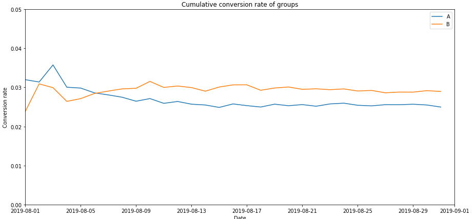
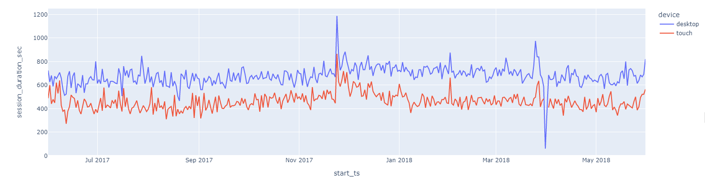
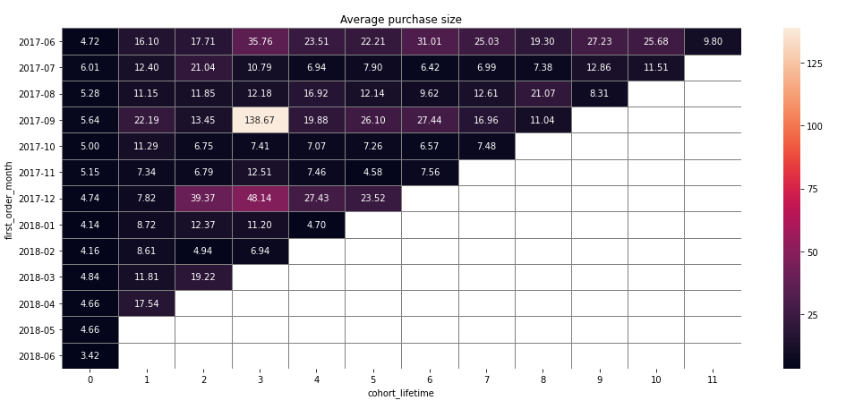
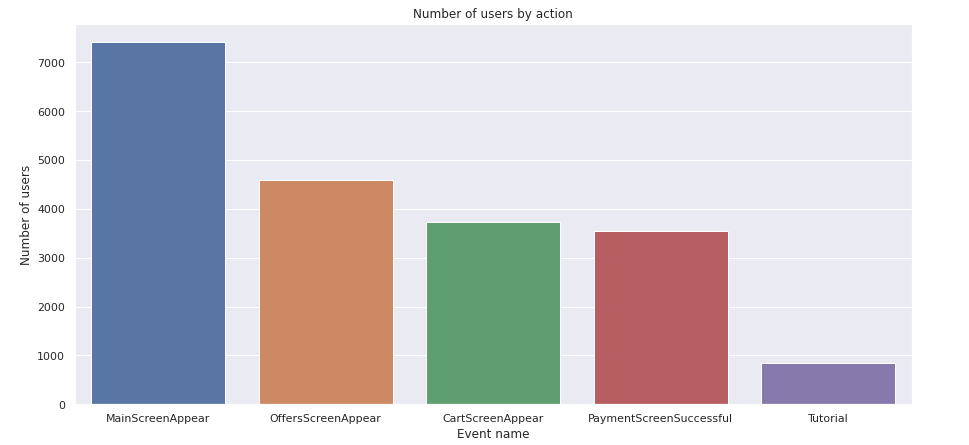
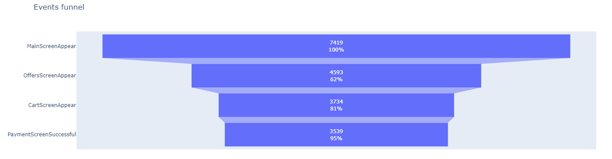

## Welcome to my portfolio. Feel free to dive into the world of data & business analytics.

## Languages & Libraries:
 - Python, Jupyter notebook, SQL, Excel, Tableau
 - Pandas, Numpy, Seaborn, Matplotlib, Plotly, Stats
 

### **Statistical Hypotheses Testing Project**
#### **Description**
Together with the marketing department, we've compiled a list of hypotheses that may help boost revenue.
We need to prioritize these hypotheses, launch an A/B test, and analyze the results. 
#### **Task**
Prioritize hypotheses, launch an A/B test, and analyze the results.

 - Prioritize hypotheses through ICE (Impact*Confidence/Effort) and RICE (Reach*Imapact*Confidenc/Effort)
 - Test statistical hypotheses using Mannwhitneyu statistics
 
 - Conclusion & recommendations

#### **Findings:**
1. There's a statistically significant difference in conversion between the groups, according to both the raw and the filtered data. Group B has higher conversion rate than group A.
2. The raw data didn't show a statistically significant difference between the groups in terms of average purchase size in both raw and the filtered data.However, after the anomalies were removed, the relative difference became smaller.
3. The graph of the difference in conversion between the groups shows that group B's results are better than those of group A: conversion rates of both groups seem to be stabilized after the first week of testing period. Overall, the conversion rate of group B is slightly higher than the conversion rate of group A.

More details: [click here](./AB_statistical_hypotheses_testing)  

### **Business Analytics Project:** **Optimizing marketing expenses**
#### **Description**
Analysing user's behavior and calcuation of business metrics such as retention, conversion, life-time value, cost of customer acquisition.
#### **Datasets:**
 - Server logs with data on Yandex.Afisha visits from June 2017 through May 2018  
 - Dump file with all orders for the period  
 - Marketing expenses statistics  

#### **Research Questions:**
 - How customers use the product  
 - When they begin to purchase  
 - Revenue generated from each user  
 - When users pay off  

#### **Findings:**
 1. The conclusion is that for planning advertising campaigns, we have to be careful about the sourcses in which we invest our money and it is better to diversify investment portfolios rather than placing everything in one basket.
 2. It is a must to consider that for marketing investments to pay off one customer acquisition can not cost more than $9.0835. Since our customers bring that amount of money in the 8 month period which is also the time to pay off.

More details: [click here](./Business_analytics)

### **Conducting A/A/B testing, studying sales funnel Project**
#### **Description**  
The goal of the project is to test whether additional feature on the app will be successful or not.
### **Task**  
 - Import and preprocess datasets
 - Exploratory data analysis
 - Study events funnel
 - Results of the experiment & recommendations

#### **Findings:**  

1. Having 3 different experiment groups, it is important to ensure that that the samples are the same. In order to do so, we want to check if there is a statistically significant difference between all of the control groups. If we find that there is a significant difference, then the control groups have been split up unequally and results will not accurately represent the population.  

2. We have calculated the p-value for all events of two experiment groups. The results tell us not to reject the H0 for all events. Thus, we can proceed with further experiment groups.  

3. We have compared both control groups with test group. All of the outcomes lead to failure of H0 implying that there is no statistically significant differences between sample groups.  

4. With the Bonferroni correction, we have adjusted the alpha = 0.0033. Moreover we have observed no change in hypotheses outcomes. Overall, we can conclude that changes in fonts do not have influence on the conversion.  

More details: [click here](./AAB_testing_user_behavior) 

