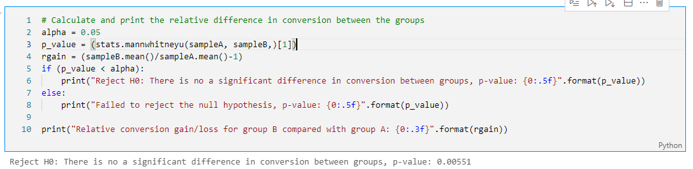

## Welcome to my portfolio. Feel free to dive into the world of data & business analytics.

## Languages & Libraries:
 - Python, Jupyter notebook, SQL, Excel, Tableau
 - Pandas, Numpy, Seaborn, Matplotlib, Plotly, Stats
 

### **Business Analytics Project:** **Optimizing marketing expenses**
#### **Description**
Analysing user's behavior and calcuation of business metrics such as retention, conversion, life-time value, cost of customer acquisition.
#### **Datasets:**
 - Server logs with data on Yandex.Afisha visits from June 2017 through May 2018
 - Dump file with all orders for the period
 - Marketing expenses statistics  

#### **Research Questions:**
 - How customers use the product
 - When they begin to purchase
 - Revenue generated from each user
 - When users pay off

#### **Findings:**
 - We would like to conclude that for planning advertising campaigns, we have to be careful about the sourcses in which we invest our money and it is better to diversify investment portfolios rather than placing everything in one egg. 
 - It is a must to consider that for marketing investments to pay off one customer acquisition can not cost more than $9.0835. Since our customers bring that amount of money in the 8 month period which is also the time to pay off.

More details: **[click here](./Business_analytics)**

### **Project:** **Statistical Hypothesis Testing**
#### **Description**
Together with the marketing department, we've compiled a list of hypotheses that may help boost revenue.
We need to prioritize these hypotheses, launch an A/B test, and analyze the results. 
#### **Task**
Prioritize hypotheses, launch an A/B test, and analyze the results.

 - Prioritize hypotheses through ICE (Impact*Confidence/Effort) and RICE (Reach*Imapact*Confidenc/Effort)
 - Test statistical hypotheses using Mannwhitneyu statistics
 
 - Conclusion & recommendations

#### **Findings:**
1. There's a statistically significant difference in conversion between the groups, according to both the raw and the filtered data. Group B has higher conversion rate than group A.
2. The raw data didn't show a statistically significant difference between the groups in terms of average purchase size in both raw and the filtered data.However, after the anomalies were removed, the relative difference became smaller.
3. The graph of the difference in conversion between the groups shows that group B's results are better than those of group A: conversion rates of both groups seem to be stabilized after the first week of testing period. Overall, the conversion rate of group B is slightly higher than the conversion rate of group A.

More details: **[click here](./AB_statistical_hypotheses_testing)**

### **Project:** **Conducting A/A/B testing, studying sales funnel**
The goal of the project is to test whether additional feature on the app will be successful or not.

 - Import and preprocess datasets
 - Exploratory data analysis
 - Study events funnel
 - Results of the experiment & recommendations

More details: [Here](./AAB_testing_user_behavior) 

